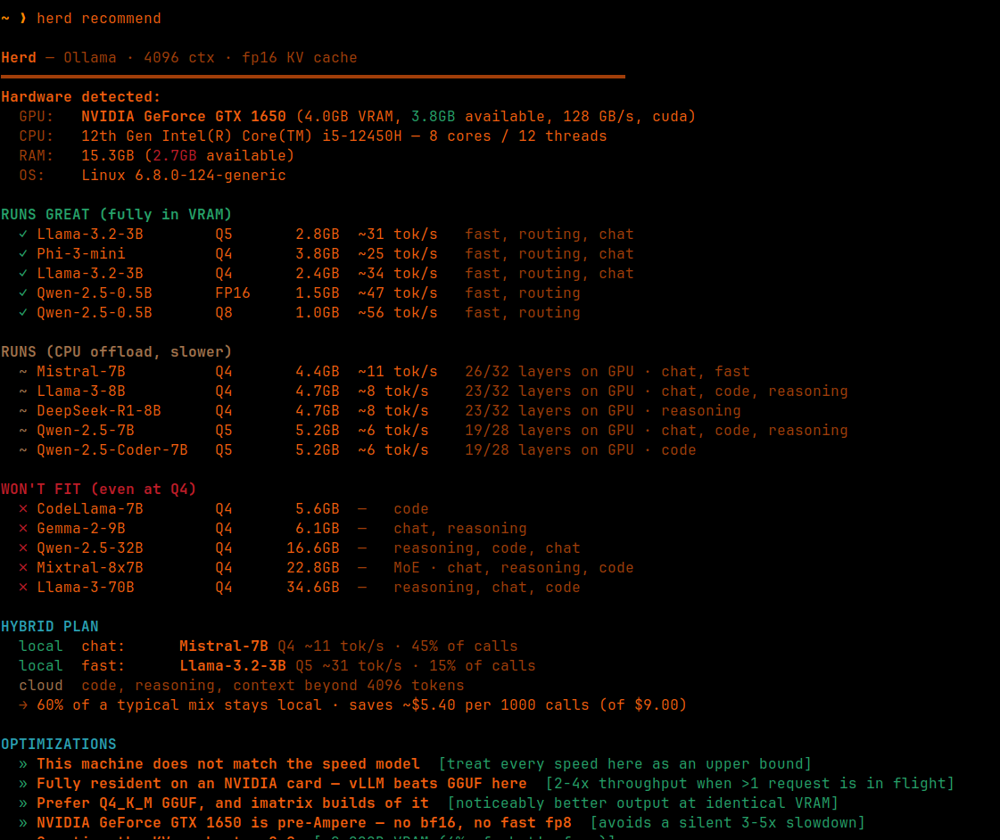
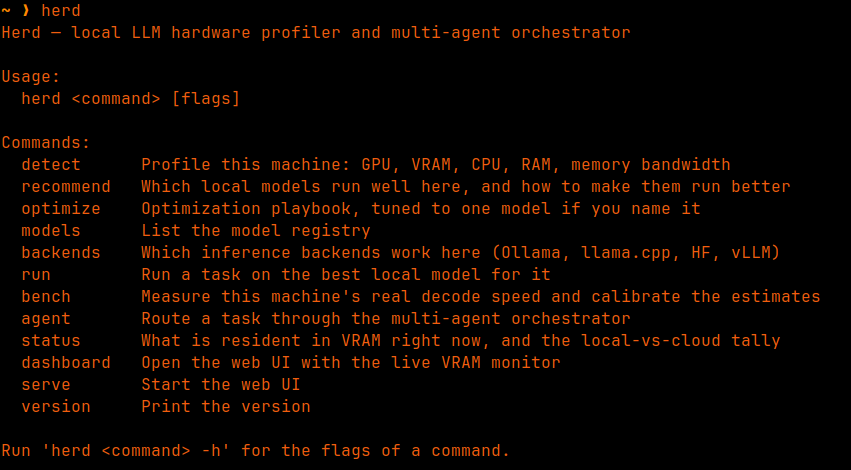

# Herd

Profiles the machine you're on, tells you which local LLMs actually run well on it and
how to make them run better, then routes tasks across those models on a VRAM budget.

Backend-agnostic: Ollama, llama.cpp, HuggingFace Transformers, or any OpenAI-compatible
server (vLLM, llama-server, LM Studio, TGI).



Every figure is computed for the machine it's running on: what's free right now, not
what the box shipped with.

## Install

```sh
make            # uv venv + pip install -e . , npm build, go build
make install    # copies bin/herd to ~/.local/bin
```

Needs Python 3.10+, [uv](https://docs.astral.sh/uv/), Go 1.22+, and Node (for the UI only).
Ollama is optional for Phase 1, required for `run`, `agent` and `bench`.

If `herd` can't find its backend from outside the source tree:
`export HERD_PYTHON=/path/to/herd/.venv/bin/python`

## Architecture

A thin Go binary in front of a Python backend, talking JSON over stdout:

```
cli/          Go — flags, colour, tables, process management. Fast startup, one binary.
herd/         Python — hardware probing, VRAM math, Ollama, orchestration.
ui/           Vite + React + Tailwind — profile view and the live VRAM monitor.
```

`herd <cmd>` runs `python -m herd <cmd>` and renders the JSON it prints. Streaming
commands (`run`, `agent`) use NDJSON so tokens appear as they're generated. Errors cross
the boundary as `{"error": ..., "hint": ...}` — a stack trace never reaches the terminal.

## Commands



```sh
herd detect                      # GPU, VRAM (total and free), CPU, RAM, bandwidth
herd recommend                   # what fits, how fast, and what to tune
herd recommend --context 32768 --kv-quant q8
herd recommend --json            # machine-readable
herd optimize --model llama3:8b  # full playbook for one model, with commands
herd models                      # the registry
herd backends                    # which inference stacks work here, and what they cost
herd bench                       # measure real decode speed, calibrate the estimates

herd run "explain async/await in Python"
herd run --backend hf "..."             # any command takes --backend
herd run --task-type code "write a binary search in Go"
herd run --model llama3:8b --file README.md "summarize this"

herd agent "write a REST API in Go"     # router picks the specialist
herd agent --verbose "..."              # show load/evict decisions live
herd agent --local "..."                # never route to the cloud
herd status                             # what's resident, which agents can run
herd dashboard                          # web UI with the live VRAM monitor
```

Tokens go to stdout, everything else to stderr, so `herd run "..." > out.md` gives you
just the answer.

## Backends

A backend is anything that can hold a model and stream tokens. `herd backends` shows
which are usable here; every command takes `--backend <id>`, and agents can each pick
their own in `agents.yaml`.

| id | what it is | model ids | notes |
|---|---|---|---|
| `ollama` | Ollama's REST API | `llama3:8b` | Easiest. GGUF, manages downloads. |
| `llamacpp` | llama-cpp-python, in-process | `repo:file.gguf` | Raw `-ngl`, cache-type and tensor-override control. |
| `hf` | Transformers, in-process | `meta-llama/…` | The whole Hub in native format. Heaviest. |
| `openai` | vLLM / llama-server / LM Studio / TGI | `meta-llama/…` | One implementation covers all of them. |

Two things the abstraction has to carry beyond `load/generate/unload`:

**Capability flags.** vLLM pre-allocates `gpu_memory_utilization` (0.9 by default) of the
entire card at startup and serves one model for its lifetime. There is no eviction to
call, and its reported usage is the reservation rather than the model. So `BackendSpec`
declares `can_evict`, `owns_card` and `reports_vram`; the scheduler never picks a
non-evictable model as an LRU victim, and `herd status` says so instead of pretending.

**Per-backend cost of the same precision.** "4-bit" is not one number. GGUF Q4_K_M,
bitsandbytes NF4 and AWQ all differ, so each backend carries a scale over the nominal
bytes-per-param table. A Llama-3-8B at Q4:

```
ollama / llamacpp   4.74 GB     GGUF
openai (AWQ)        4.69 GB     4-bit + scales and zero-points, no runtime overhead
hf (bnb NF4)        5.70 GB     4-bit + absmax scales, heavier torch CUDA context
any backend, FP16  15.96 GB     native safetensors — the number people forget
```

Backends other than Ollama are optional extras and stay lazily imported, so nothing
breaks on a machine with no ML stack:

```sh
uv pip install 'herd[hf]'        # torch, transformers, accelerate, bitsandbytes
uv pip install 'herd[llamacpp]'  # llama-cpp-python
```

## The VRAM math

For each model at each quantization:

```
weight   = params_B × 1e9 × bytes_per_param / 1024³      Q4=0.5  Q5=0.625  Q8=1.0  FP16=2.0
kv_cache = 2 × layers × kv_heads × head_dim × ctx × batch × kv_bytes / 1024³
total    = weight + kv_cache + 0.5                       0.5GB for the CUDA runtime
```

Two deliberate refinements over the naive version:

**KV cache uses `n_kv_heads`, not `n_heads`.** Llama-3, Mistral and Qwen-2.5 use
grouped-query attention — 8 KV heads against 32 attention heads. Using the attention
head count overstates the cache by 4x. CodeLlama-7B, which has no GQA, is the control
case: same shape, genuinely 4x the cache.

**Speed includes a fixed per-token cost.** Pure `bandwidth / bytes` assumes decode is
entirely memory-bound. True for a 70B, badly wrong for a 0.5B, where kernel launches and
sampling dominate.

`herd bench` times every installed model that fits, each on an otherwise empty card, and
least-squares fits `seconds_per_token = bytes / bandwidth + fixed`. Two differently sized
models are needed to solve for both terms — with one, it can only assume the rated
bandwidth is real and says so.

It also refuses to store a fit that isn't physically possible. On the machine this was
developed against:

```
qwen2.5:0.5b   1.21GB   19.8 tok/s   (bandwidth-only would predict 106)
llama3.2:3b    3.08GB    4.3 tok/s   (bandwidth-only would predict  42)
```

Those two points imply 10 GB/s against a rated 128, and a *negative* fixed cost. That
isn't a calibration, it's a symptom — the GPU is throttled, shared, or not doing the
work. Herd records the rejection with its reason and keeps saying "unvalidated" rather
than encoding a confident wrong number. `herd detect` separately flags a driver that
can't report its own clocks or power, which is what turned out to be true here.

MoE models are flagged: all experts must be resident (Mixtral costs like a 47B) but only
the active ones are read per token (it decodes like a 13B).

Estimates, not benchmarks. Anything within ~20% is doing its job.

## Optimization advice

`herd recommend` and `herd optimize` emit only the levers that apply to your machine and
model — runtime choice (llama.cpp/GGUF vs vLLM vs MLX, decided by whether the model is
fully resident), quant format (K-quants, imatrix, when to drop to IQ4_XS, pre-Ampere
caveats), KV cache quantization with the GB it saves, flash attention, the exact
`-ngl` layer count, MoE expert offload, speculative decoding, prompt-prefix reuse,
grammar-constrained output. Each carries the command to run it.

## Configuration

**`herd/models.json`** — the model registry. Add entries, no code change, no rebuild.
Needs `params_b`, `layers`, `n_heads`, `n_kv_heads`, `head_dim`, `quants`, `use_cases`.
Each backend reads its own reference field — `ollama`, `hf_repo`, `gguf_repo` — and a
model missing one simply isn't offered on that backend.
Cloud pricing and the assumed workload mix used for savings estimates live in `defaults`.

**`herd/gpus.json`** — memory bandwidth per GPU, matched longest-key-first against the
detected device name. Unknown cards fall back to a per-vendor figure and say so.

**`herd/agents.yaml`** — the agent roster. Each agent has a role prompt, a preferred
model and a fallback; a `cloud/` prefix routes off-machine, `pinned: true` keeps it
resident, and `backend:` picks its inference stack (model ids are backend-specific).
Override the path with `$HERD_AGENTS`.

## The scheduler

`ModelScheduler` decides what's resident rather than letting a runtime's idle timer do
it. There is one scheduler per backend, since each tracks its own residency.
`acquire()` returns immediately on a cache hit; otherwise it evicts least-recently-used
models until there's room, then loads. Pinned models (the router) and models currently
held by a running agent are never evicted — under real pressure it reports the squeeze
instead of stealing a model out from under an agent. The backend's own report is the source of
truth; the scheduler never trusts its own bookkeeping over the runtime's.

Pinning is advisory. Ollama runs its own memory manager: asked to load a model that
doesn't fit alongside what's resident, it will evict something first — including a model
Herd pinned. `refresh()` notices and updates, so status stays truthful, but Herd cannot
veto the runtime's decision. In-process backends (`hf`, `llamacpp`) don't have this
problem because Herd holds the objects itself.

Hybrid routing sends a task to the cloud only when the router scores it above
`complexity_threshold` **and** the best local model runs below `min_tok_s`. The
local/cloud tally and estimated savings persist in `~/.config/herd/stats.json`.

## Tests

```sh
make test
```

`tests/test_vram.py` covers the math (weights, GQA cache, tier boundaries, MoE, speed
ordering, calibration). `tests/test_scheduler.py` covers eviction policy against a
stubbed Ollama — LRU order, pinning, in-use protection, pressure reporting.
`tests/test_backends.py` covers the abstraction: per-backend 4-bit costs, capability
filtering, and that a non-evictable backend is never chosen as a victim. None of them
need a backend installed or gigabytes downloaded.

## Known limits

- Bandwidth is a lookup table, not a measurement. Unknown GPUs get a vendor default.
- Multi-GPU is summed, and the fit math assumes tensor parallelism.
- AMD detection goes through `rocm-smi` and is coarser than NVIDIA's.
- Quantization is modelled by bit width; real GGUF variants (Q4_K_M vs IQ4_XS) differ by
  a few percent at the same nominal bits.
- A 0.5B router classifies tasks poorly. Give it a 3B if you have the VRAM.
- The reference machine's driver reports `ERR!` for power and clocks, so its own
  calibration is rejected by the tool. Speed estimates there are upper bounds.
- Only the Ollama backend has been exercised end to end here. The llama.cpp, HF and
  OpenAI-compatible backends are written against their documented APIs and degrade
  cleanly when absent, but have not been run against live installs.
- With two models and a 4GB card, Ollama evicted the pinned router before Herd's own LRU
  had a chance to act. Expected, given the above, but it means eviction *order* on the
  Ollama backend is a negotiation rather than a decision.
- HF and llama.cpp keep models in the calling process, so their residency is per-process:
  a `herd agent` run and a `herd serve` process do not share loaded weights the way they
  do through Ollama's daemon.
